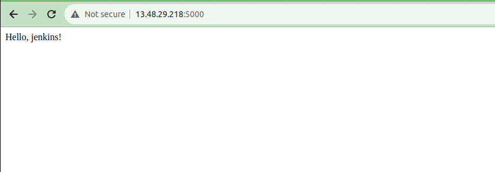

# Jenkins

## Cоздаем бесплатный истанс на амазоне и устанавливаем на нем дженкинс и докер

Дженкинс с помошью скрипта 
```
sudo apt-get update
sudo apt-get install openjdk-17-jdk
sudo apt-get update
sudo wget -O /usr/share/keyrings/jenkins-keyring.asc \
  https://pkg.jenkins.io/debian-stable/jenkins.io-2023.key
echo deb [signed-by=/usr/share/keyrings/jenkins-keyring.asc] \
  https://pkg.jenkins.io/debian-stable binary/ | sudo tee \
  /etc/apt/sources.list.d/jenkins.list > /dev/null
sudo apt-get update
sudo apt-get install jenkins
```
Докер с помошью команд

```
#скачивание скрипта установки Docker 

curl -fsSL https://get.docker.com -o get-docker.sh

#установка Docker

sudo sh get-docker.sh

#добавление в группу sudo (jenkins, Docker) 

sudo usermod -aG docker jenkins
sudo usermod -aG sudo jenkins
```

## Создаем докер файл и простое приложение

Докер файл


Простое приложение


## Делаем пайплайн для Staging

```
pipeline {
    agent any

    stages {
        stage('Build') {
            steps {
                echo 'start building'
                dir('./') {
                    sh 'docker build -t app .'
                }
            }
        }
        
        stage('Backup') {
            when {
                expression { currentBuild.resultIsBetterOrEqualTo('SUCCESS') }
            }
            steps {
                echo 'creating backup'
                script {
                   sh 'mkdir -p /var/lib/jenkins/workspace/Staging/backup-directory'
                }
                sh 'docker save app -o /var/lib/jenkins/workspace/Staging/backup-directory/app-artifact.tar'
                echo 'backup completed'
            }
        }
        
        
        stage('Deploy') {
            when {
                expression { currentBuild.resultIsBetterOrEqualTo('SUCCESS') }
            }
            steps {
                echo 'start deploying application'
                sh 'docker run -d -p 5000:5000 app'
            }
        }
    }
}
```
Запускаем 


Открываем страницу в браузере



все работает!

## Настроить автоматический запуск деплоя при добавлении нового commit’а

Переходим в настройки Staging

Нажимаем и вставляем url нашего гитхаба


Переходи на страницу гитхаб, переходим в настройки репозитория, и нажимаем на вкладку Webhooks и добавляем webhook

Прописываем URL нашего дженкинса и добавляем github-webhook/
Меняем Content type на json

Важно убедиться в том, что порт 8080 открыт не только для вас


Сохраняем, меняем немного дженкинс файл и пушим

# Все работает!


# Проект “Production”

Меняем текст в нашем приложении


Меняем Дженкинс файл

```
pipeline {
    agent any

    stages {
        stage('Build Production') {
            steps {
                echo 'start building Production'
                dir('./') {
                    sh 'docker build -t app .'
                }
            }
        }
        
        stage('Backup Production') {
            when {
                expression { currentBuild.resultIsBetterOrEqualTo('SUCCESS') }
            }
            steps {
                echo 'creating backup'
                script {
                   sh 'mkdir -p /var/lib/jenkins/workspace/Staging/backup-directory-prod'
                }
                sh 'docker save app -o /var/lib/jenkins/workspace/Staging/backup-directory-prod/artifact-prod.tar'
                echo 'backup completed'
            }
        }
        
        
        stage('Deploy Production') {
            when {
                expression { currentBuild.resultIsBetterOrEqualTo('SUCCESS') }
            }
            steps {
                echo 'start deploying production application'
                sh 'docker run -d -p 5001:5000 app'
            }
        }
    }
}
```

заливаем все на ветку main

Создаем проект дженкинс и сразу прописываем настройки для webhook

Так же настраеваем Webhook на гитхабе


Все работает!